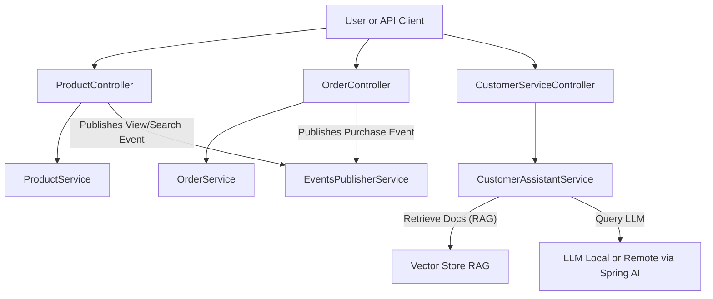

# Spring AI Shopping Service

This project is a **Sample Shopping Service Application** designed to demonstrate the integration of [Spring AI](https://docs.spring.io/spring-ai/reference/) modules with Large Language Models (LLMs). It showcases how modern AI technologies can enhance shopping experiences through conversational AI and Retrieval-Augmented Generation (RAG) techniques.

## Features

- **Customer Support**: Users can interact with the service via chat to get assistance from AI.
- **Product Search**: Users can search for recommended products intuitively.
- **User Shopping Behavior Analysis**: The service leverages LLMs to analyze and provide insights into users' shopping habits and preferences.
- **Flexible LLM Connectivity**:
    - **Local Models**: Easily connect to and run local LLMs using the provided `docker-compose` file for rapid prototyping and development.
    - **Remote/Cloud Models**: Seamlessly integrate with remote LLMs hosted on the cloud for production-grade scalability and reliability.

## How It Works

- **Spring AI Integration**: Utilizes Spring AI modules to abstract and simplify communication with LLMs, whether local or remote.
- **Chat and RAG**: Supports both standard conversational AI (chat) and advanced RAG to ground responses in your product data or external knowledge bases.
- **Pluggable Model Support**: You can switch between local and remote model endpoints without changing the core application logic.

## Architecture diagram


## Getting Started

### Prerequisites

- Java 17 or later
- Docker (for local model deployment)
- [Spring Boot](https://spring.io/projects/spring-boot)
- Access to a supported LLM, either local or cloud-based

### Local Development

1. **Clone the repository**:
    ```shell
    git clone https://github.com/ahmfarghaly/sa-spring-ai-shopping-service.git
    cd sa-spring-ai-shopping-service
    ```

2. **Start a Local LLM (Optional)**:
    - Use the provided `docker-compose.yml` to spin up a compatible LLM locally.

3. **Configure Model Endpoint**:
    - Adjust your application properties to point to either your local or remote LLM.

4. **Run the Application**:
    ```shell
    ./mvnw spring-boot:run
    ```

### Connecting to Remote Models

- Update the model endpoint configuration to your cloud provider's LLM endpoint.
- Ensure credentials and networking permissions are set up accordingly.

## API Summary

The API is RESTful and organized by domain (products, orders, analytics, customer service).
- **ProductController (`/api/products`)**
- **OrderController (`/api/orders`)**
    - Product and order endpoints are standard for a shopping service, with added hooks for analytics and event publishing.
- **AnalyticsController (`/api/analytics`)**
    - Analytics endpoints leverage LLMs for advanced business insights (behavior, performance, customer journey, etc).
- **CustomerServiceController (`/api/customer-service`)**
    - Customer service endpoints demonstrate chat and recommendation features using LLM and RAG.

## Contributing

Contributions are welcome! Please fork the repo and submit pull requests for enhancements or bug fixes.

## License

This project is licensed under the MIT License.

## Acknowledgements

- [Spring AI](https://docs.spring.io/spring-ai/reference/)
- Open-source LLM communities and contributors